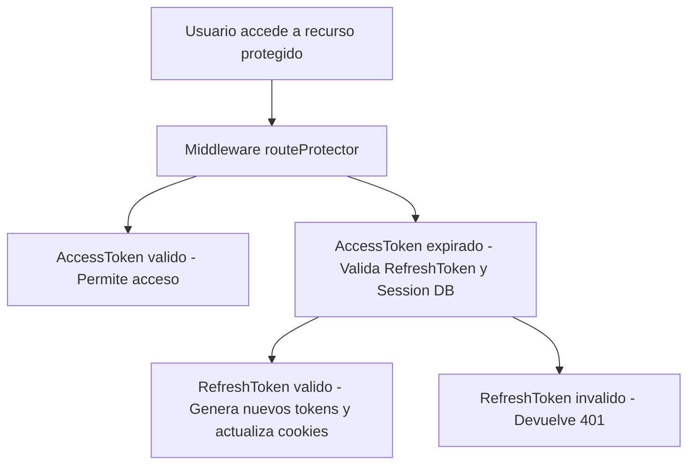

## 🔐 Autenticación y Seguridad

Este proyecto implementa un sistema de autenticación robusto basado en JWT y sesiones persistentes.

### Flujo de Autenticación

1. **Inicio de sesión (`/auth/login`):**

   - El usuario envía su email y contraseña.
   - Si las credenciales son válidas:
     - Se genera un `accessToken` (JWT, expira en 15 minutos).
     - Se genera un `refreshToken` (JWT, expira en 7 días).
     - Se crea un registro de sesión en la base de datos vinculado al `refreshToken`.
     - Ambos tokens se envían al cliente en cookies `HttpOnly`.

2. **Protección de rutas (`routeProtector` middleware):**

   - Cada request protegida valida el `accessToken`.
   - Si el `accessToken` ha expirado:
     - Se verifica el `refreshToken`.
     - Si es válido y pertenece a una sesión activa:
       - Se emite un nuevo `accessToken` (y opcionalmente un nuevo `refreshToken`).
       - Se actualizan las cookies en la respuesta.
     - Si no es válido: acceso denegado (401).

3. **Cierre de sesión (`/auth/logout`):**
   - Elimina la sesión correspondiente en la base de datos.
   - Elimina ambos tokens de las cookies.

---

### 🗺️ Flujo de protección de rutas

